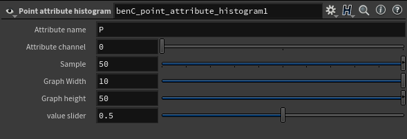
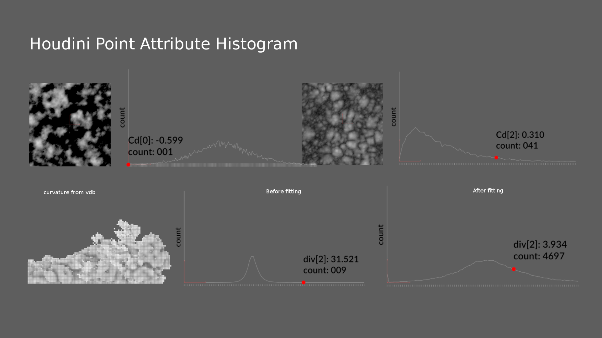

# Point Attribute Histogram

This histogram tool shows the distribution of a point attribute in it's full range. This is useful for finding the right maximum and minimum values for remapping attributes to color.

[Download on orbolt](https://www.orbolt.com/asset/ben_Chan::benC_point_attribute_histogram)

